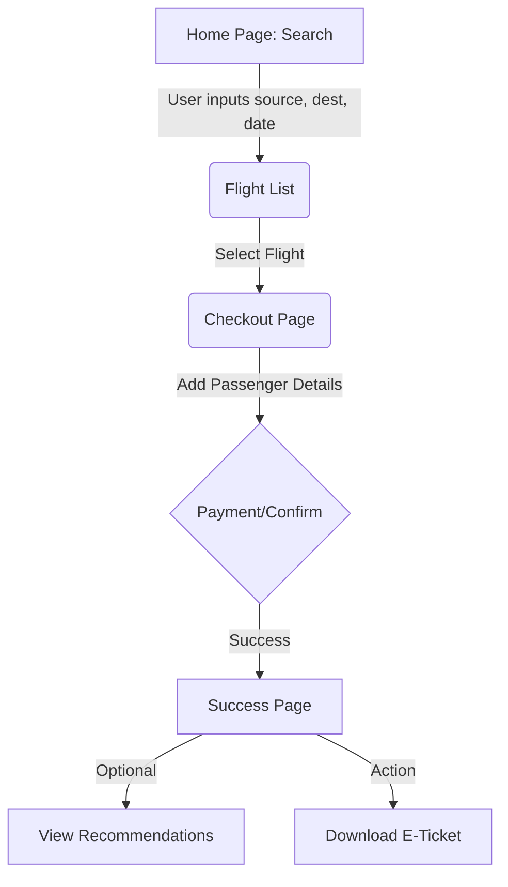
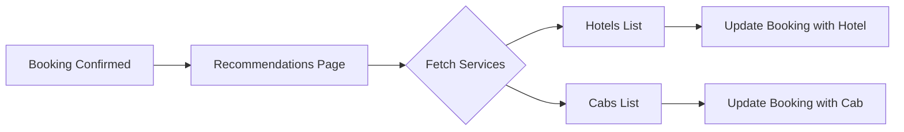
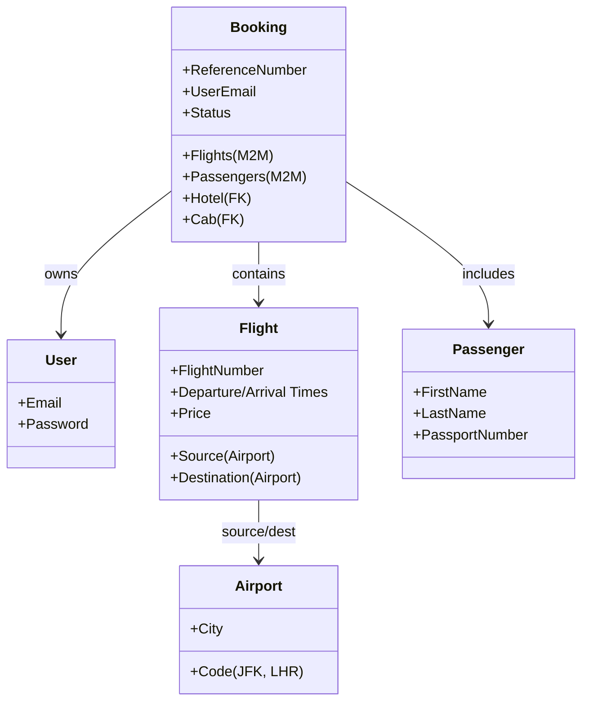

# ✈️ SkyLooms: System Analysis & Workflow Report

SkyLooms is a premium, full-stack airline booking platform. This report provides a comprehensive analysis of the project's architecture, codebase, and core workflows.

---

## 🏗️ 1. System Architecture

SkyLooms follows a classic **client-server architecture** using a modern tech stack.

### **Frontend (React + Vite)**
- **Framework**: React 19 with Vite for fast builds.
- **Routing**: React Router 7 for seamless navigation.
- **State Management**: Context API (`AuthContext`, `BookingContext`) to manage user sessions and booking flows.
- **Styling**: Custom CSS with a "Glassmorphism" aesthetic, utilizing backdrop blurs and deep navy/sky blue gradients.
- **API Communication**: Axios for communicating with the Django REST API.

### **Backend (Django REST Framework)**
- **Framework**: Django with DRF for API endpoints.
- **Database**: SQLite (Development) / PostgreSQL (Production).
- **Authentication**: JWT (JSON Web Tokens) via `rest_framework_simplejwt`.
- **Modular Apps**:
  - `flights`: Airport and Flight data management.
  - `bookings`: Core booking logic, passenger data, and reference generation.
  - `accommodations`: Hotel recommendations.
  - `cabs`: Airport transfer/cab recommendations.
  - `core`: User registration and authentication profile.

---

## 🔄 2. Core Workflows

### **A. Flight Booking Workflow**
This is the primary workflow of the application.

1.  **Search**: Users search for flights via `Home.jsx`. The frontend calls `api/flights/search/`.
2.  **Selection**: Flights are selected and stored in the `BookingContext`.
3.  **Checkout**: In `Checkout.jsx`, users enter passenger information.
4.  **Booking**: Data is sent to `api/bookings/`. The backend generates a unique **6-character reference number** and calculates the total price.
5.  **Success**: The user is redirected to `Success.jsx` where the booking details and recommendations are shown.

### **B. Recommendation Engine Workflow**
After a flight is booked, the system suggests relevant travel services.

- **Logic**: Based on the destination of the flight, the system fetches hotels and cabs from the `accommodations` and `cabs` apps.
- **Data Source**: Initial data is seeded from `hotels.json` and `cab.json`.

---

## 📂 3. Codebase Analysis (Folder Structure)

### **Root Directory**
- `backend/`: Django project root.
- `frontend/`: React project root.
- `*.json`: Data seed files (Cabs, Hotels, Flight Services).
- `README.md`: Project documentation.

### **Backend Breakdown (`/backend`)**
| Folder/File | Purpose |
| :--- | :--- |
| `config/` | Main project settings, root URLs, and WSGI/ASGI config. |
| `flights/` | Models: `Airport`, `Flight`. Handles search logic. |
| `bookings/` | Models: `Booking`, `Passenger`. Core logic for ticket generation and reference numbers. |
| `accommodations/` | Models: `Hotel`. Manages lodging data. |
| `cabs/` | Models: `Cab`. Manages transport data. |
| `seed.py` | Utility script to populate the DB from JSON files. |

### **Frontend Breakdown (`/frontend/src`)**
| Folder/File | Purpose |
| :--- | :--- |
| `pages/` | Main views (Home, Checkout, Recommendations, Manage, Status). |
| `components/` | Reusable UI elements (Navbar, Card, FlightResult, Footer). |
| `context/` | `AuthContext` (Login state) and `BookingContext` (Booking state). |
| `App.jsx` | Defines all frontend routes. |
| `index.css` | Global design tokens, animations, and glassmorphic styles. |

---

## 📊 4. Database Schema (Simplified)

---

## 🛠️ 5. Key Implementation Details

1.  **Reference Number Generation**: Found in `backend/bookings/models.py`. It uses a random string generator to create unique 6-character IDs (e.g., `BK9A2Z`) for travel verification.
2.  **PDF Ticket Generation**: The backend contains a view `download_ticket` which likely uses a library (like `reportlab`) to generate a formatted PDF with flight details, passenger names, and the booking reference.
3.  **Glassmorphism Design**: The `index.css` contains extensive use of `backdrop-filter: blur(10px)` and transparency to create the premium "Sky" feel.
4.  **Seeding Logic**: The `seed.py` is a robust script that clears existing data and rebuilds the database from JSON, ensuring consistent development environments.

---

## 🚀 Future Roadmap (Observations)
- **AI Integration**: The `README` mentions AI-driven suggestions; currently, this is implemented as a matching logic between destination and service locations.
- **Payment Gateway**: The `Booking` model has a `payment_id` field, indicating readiness for Stripe or PayPal integration.
- **Flight Status**: `Status.jsx` is prepared to show real-time tracking, which could be integrated with external flight data APIs.
